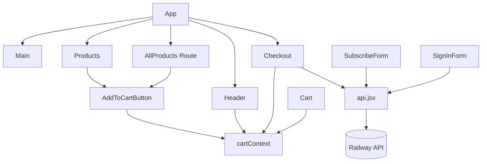

# Frontend Client

This is the canonical React/Vite client for the E-Commerce Store.

## Live URL

- https://shop-seven-lyart.vercel.app/

## Overview

This frontend is a React single-page application for browsing products, adding items to cart, signing in, and submitting checkout orders to the backend API.

## Main Features

- Product listing and modal preview interactions
- Add-to-cart flow with inline button feedback
- Cart overlay with quantity updates and subtotal display
- Sign in / sign out UI with status feedback
- Checkout form with client-side guardrails and submit confirmation state
- Newsletter subscription flow with API error feedback

## Tech Stack

- React
- React Router
- Vite
- CSS modules by component folder
- Fetch API for backend communication

## Commands

- `npm run dev`: start the development server
- `npm run build`: create a production build
- `npm run lint`: run ESLint

## Local Setup

1. Install dependencies:

   ```bash
   npm install
   ```

2. Create `.env` from `.env.example`.
3. Set `VITE_API_URL` to your backend URL.
4. Start the app:

   ```bash
   npm run dev
   ```

Set `VITE_API_URL` in `.env` to the URL where the Express API is running. See `.env.example` for the local default.

For production on Vercel, set `VITE_API_URL` in the Vercel project environment settings to your Railway backend URL.

## Challenges and Lessons Learned

- CORS and environment configuration:
  moved hardcoded URLs to environment variables and aligned frontend/backend origins across local and deployed environments.
- Checkout validation mismatch:
  aligned frontend payload shape with backend guest/auth order schemas and improved error surfacing.
- Mobile responsiveness:
  adjusted header and button layouts to avoid overlap and improve readability on small screens.
- UX feedback clarity:
  added temporary success states (for add-to-cart, sign-out, and order submit) so users get immediate confirmation.

## Future Improvements

- Integrate a real payment provider (for example Stripe Elements)
- Add component and integration tests for key flows
- Add accessibility pass (focus states, keyboard paths, aria labels)

## Architecture

The frontend is organized by feature-oriented components and shared context state:

- `App` composes page sections and route views.
- `cartContext` provides cart state and mutations to product/cart/checkout components.
- Feature components call API helpers in `src/api.jsx`, which target the backend base URL from `VITE_API_URL`.
- Form-based components (sign in, checkout, subscribe) submit payloads to backend endpoints and display inline feedback.

### Component and Data Flow


