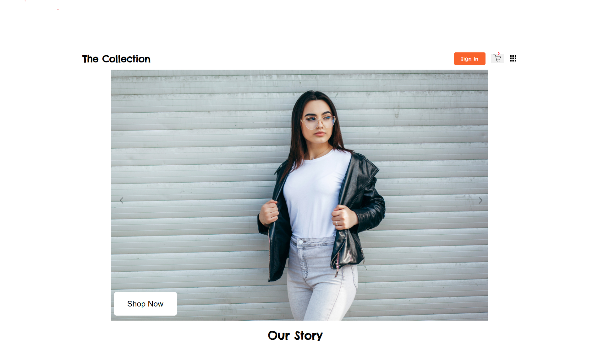

[](https://www.loom.com/share/47c27b4b01b74cbaa627456964700c62)

# E-Commerce Store

Full-stack clothing store built with React, Vite, Express, MongoDB, and Mongoose.

## Live Demo

- Frontend (Vercel): https://shop-seven-lyart.vercel.app/
- Backend API base (Railway): https://shop-production-64fa.up.railway.app

## Features

- Product browsing and product detail modal
- Persistent cart using localStorage
- User registration and cookie-based login
- Guest and authenticated order flows
- Newsletter subscription with duplicate-email protection
- Joi request validation and centralized error responses

## Project Structure

- `Frontend/Client_Side`: canonical Vite frontend
- `Server_Side`: Express API, MongoDB models, authentication, and validation

The active application lives in `Frontend/Client_Side`, with the API in `Server_Side`.

## Local Setup

1. Install MongoDB and start a local database.
2. Install the server dependencies:

   ```bash
   cd Server_Side
   npm install
   ```

3. Install the frontend dependencies:

   ```bash
   cd ../Frontend/Client_Side
   npm install
   ```

4. Copy `Server_Side/.env.example` to `Server_Side/.env` and set strong secrets.
5. Copy `Frontend/Client_Side/.env.example` to `Frontend/Client_Side/.env`.
6. Start the API with `npm start` from `Server_Side`.
7. Start the frontend with `npm run dev` from `Frontend/Client_Side`.

## Deployment

- Frontend is deployed on Vercel.
- Backend is deployed on Railway.
- Vercel environment variable `VITE_API_URL` should point to your Railway backend URL.
- Railway should define these environment variables:
  - `PORT`
  - `NODE_ENV=production`
  - `MONGODB_URI`
  - `FRONTEND_URL=https://shop-seven-lyart.vercel.app`
  - `JWT_SECRET`
  - `GUEST_ORDER_SECRET`

## API Overview

- `GET /clothing-items`
- `POST /login/register`
- `POST /login`
- `POST /login/logout`
- `GET /orders`
- `POST /orders`
- `POST /subscribe`

## Testing

Run server validation tests with `npm test` from `Server_Side`. Run the frontend production check with `npm run build` from `Frontend/Client_Side`.

## Payment Status

The checkout currently creates an order without collecting card details. A real payment provider would be integrated before accepting payments in production.
